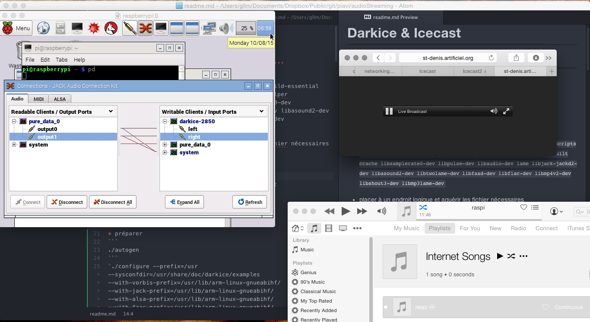

# Darkice & Icecast
## webradio pour raspberry pi
### tutoriel d'installation à jour (2015)
#### Compiler Darkice avec les options «fancy!»
##### Encore en phase de test et d'optimisations...

résultat :

Une carte de son (même de très entrée de gamme) est essentielle

* Pi 2
  * Streaming stéréo sans problèmes avec carte USB
* Pi 1
  * Streaming mono avec carte USB


Comme plusieurs,  en cherchant comment faire faire fonctionner le Darkice avec le raspberry pi,  je suis tombé sur  très bon blog post:
https://stmllr.net/blog/live-mp3-streaming-from-audio-in-with-darkice-and-icecast2-on-raspberry-pi/
Le problème avec la manoeuvre décrite dans cet article c'est qu'elle ne fonctionne que pour le raspberry-pi 1.
De plus, la version de darkice que l'auteur a modifié puis hébergé sur son serveur est plusieurs versions en retard sur le tronc principal de Darkice.
D'ailleurs,  beaucoup des instructions exposées servent à créer un paquet d'installation Debian ce que nous n'avons potentiellement pas de  besoins ( à vérifier sur une fresh install....!)



Ce résumé d'instructions sert à compiler la version là plus récente hébergée sur github le plus simplement possible.  


* Installer les dépendences <br>
`sudo apt-get --no-install-recommends install build-essential devscripts autotools-dev fakeroot dpkg-dev debhelper autotools-dev dh-make quilt ccache libsamplerate0-dev libpulse-dev libaudio-dev lame libjack-jackd2-dev libasound2-dev libtwolame-dev libfaad-dev libflac-dev libmp4v2-dev libshout3-dev libmp3lame-dev`

* Installer les outil de compilation
```
sudo apt-get install autoconf automake libtool
```

* Occuper un endroit logique et acquérir les fichiers nécessaires
```
mkdir src && cd src
```
```
git clone https://github.com/rafael2k/darkice.git
```
```
cd darkice/darkice/trunk
```

* Préparer
```
./autogen.sh
```
`./configure --prefix=/usr --sysconfdir=/usr/share/doc/darkice/examples --with-vorbis-prefix=/usr/lib/arm-linux-gnueabihf/ --with-jack-prefix=/usr/lib/arm-linux-gnueabihf/ --with-alsa-prefix=/usr/lib/arm-linux-gnueabihf/ --with-faac-prefix=/usr/lib/arm-linux-gnueabihf/ --with-aacplus-prefix=/usr/lib/arm-linux-gnueabihf/ --with-samplerate-prefix=/usr/lib/arm-linux-gnueabihf/ --with-lame-prefix=/usr/lib/arm-linux-gnueabihf/`

* Compiler
```
make
```
*  sur le raspberry pi 2 (compiler en quad core!)
```
make -j4
```

* Installer dans le dossier des executables
```
sudo cp src/darkice /usr/local/bin/
```
* copier le fichier de configuration de *darkice* dans à l'endroit où il le cherche
```
sudo cp darkice.cfg /etc/
```

* invoquer le programme en faisant :
```
darkice
```

#### configuration darkice
```
sudo nano /etc/darkice.cfg
```
 voir [darkice.cfg](darkice.cfg) pour quelque chose qui a fini par marcher...

* trucs tricky
  * ALSA peut-être compliqué,  j'avais plusieurs périphériques USB de branchés et mon microphone tombait dans le lieu hw:2,0
  * s'assurer que la config concorde avec Icecast
  * En commantentant les instructions qui étaient liées à Icecast1 et shoutcast, ça a fini par marché
  * dans le cas où on utilise seulement avec alsa, invoquer darkice en sudo ça peut aider
  * Changer les mots de passe dans les deux fichiers de config

#### installer icecast2
```
sudo apt-get install icecast2
```
#### configuration icecast2
```
sudo nano /etc/icecast2/icecast.xml
```
voir [icecast.xml](icecast.xml)
* pour arrêter et redémarrer icecast2
```
/etc/init.d/icecast2 stop
sudo /etc/init.d/icecast2 start
```

Et maintenant?

#### Transmettre le son entrant dans une carte de son directement vers Darkice
* trouver l'adresse ALSA de carte de son
```
aplay -l
```
  * Le pi devrait retourner ça
  ```
  **** List of PLAYBACK Hardware Devices ****
card 0: ALSA [bcm2835 ALSA], device 0: bcm2835 ALSA [bcm2835 ALSA]
  Subdevices: 8/8
  Subdevice #0: subdevice #0
  Subdevice #1: subdevice #1
  Subdevice #2: subdevice #2
  Subdevice #3: subdevice #3
  Subdevice #4: subdevice #4
  Subdevice #5: subdevice #5
  Subdevice #6: subdevice #6
  Subdevice #7: subdevice #7
card 0: ALSA [bcm2835 ALSA], device 1: bcm2835 ALSA [bcm2835 IEC958/HDMI]
  Subdevices: 1/1
  Subdevice #0: subdevice #0
card 1: H4 [H4], device 0: USB Audio [USB Audio]
  Subdevices: 1/1
  Subdevice #0: subdevice #0
  ```
  * pour traduire l'adresse de la carte de son ,  remplacer X par le chiffre suivant «card» dans l'expression suivant
  ```
  hw:X,0
  ```
* Éditer le fichier de config darkice par exemple
```
sudo nano /etc/darkice.cfg
```
Chercher pour la ligne
```
device
```
* désigner la carte de son ALSA comme signal d'entrée (en prenant soin de remplacer le X par le chiffre de la carte touvée précédament)
```
device        = hw:X,0    # Alsa audio input
```
dans notre cas
```
device        = hw:1,0    # Alsa audio input
```

* démarrer darkice avec la configuration adéquate.
```
darkice
```
* ecouter le stream a l adresse suivante(remplacer XXX,YYY) par l'adresse Ip du pi

http://192.168.XXX.YYY:8000/raspi.m3u

* En cas de buffer overun


référence :

le github du projet (version la plus à jour, mais manque d'instructions pour compiler sur le pi)
https://github.com/rafael2k/darkice/tree/master/darkice/trunk

inspiration principale,  mais n'est plus à jour
https://stmllr.net/blog/live-mp3-streaming-from-audio-in-with-darkice-and-icecast2-on-raspberry-pi/

Blogue d'église qui aime le pi
http://raspberry-pi.blogspot.ca

de quoi mieux comprendre l'audio sur le pi
http://computers.tutsplus.com/articles/using-a-usb-audio-device-with-a-raspberry-pi--mac-55876

des pistes pour déboguer ALSA
http://linuxconfig.org/how-to-test-microphone-with-audio-linux-sound-architecture-alsa

Une bonne piste a jour

http://pastebin.com/mU6GWWnA


Certaines erreurs que j'ai rencontrées


sh autogen.sh


checking for lame library at /usr ... configure: WARNING: not found, building without lame
checking for vorbis libraries at /usr ... configure: WARNING: not found, building without Ogg Vorbis
checking for opus libraries at /usr ... configure: WARNING: not found, building without Ogg Opus
checking for faac library at /usr ... configure: WARNING: not found, building without faac
checking for aacplus library at /usr ... configure: WARNING: not found, building without aacplus
checking for twolame library at /usr ... found at /usr
checking for alsa libraries at /usr ... configure: WARNING: not found, building without ALSA support
checking for pulseaudio libraries at /usr ... configure: WARNING: not found, building without PULSEAUDIO support
checking for jack libraries at /usr ... configure: WARNING: not found, building without JACK support
checking for samplerate libraries at /usr ... configure: WARNING: not found, building libsamplerate support

Ce qui c'est passé c'est que je n'avais pas bien lié les différentes libraries dans à la configuration.  
Le pi installe ses librairie à une autre place que à /usr


J'ai essayer d'installer Lame comme suit....  je pense que ce n'est pas nécessaire si les libs sont bien liées

Installing Lame
---------------

To install DarkIce, you need the Lame 3.89 or later libraries and
related header files already installed on your system.

It is recommended that use install Lame to the usual system locations,
/usr/lib, /usr/include, so that DarkIce will find the header files and
libraries. Thus when configuring, add --prefix=/usr to the configure
options.

Grab the latest lame source tarball from a download site found at
http://www.mp3dev.org/mp3/download/download.html
or from the DarkIce SourceForge project download area
http://sourceforge.net/project/showfiles.php?group_id=14111

I took lame lame-3.91.tar.gz. Go to the directory where you saved it,
and issue the following commands:

tar xfz lame-3.91.tar.gz
cd lame-3.91
./configure --with-fileio=lame --without-vorbis --disable-gtktest --enable-expopt=full --prefix=/usr
make
sudo make install

For the last step, you need to be root or have write permissions in the
target directories.

You might consider using nasm if you're on a i386 system, with the
configure option --enable-nasmm, for maximum performance.
